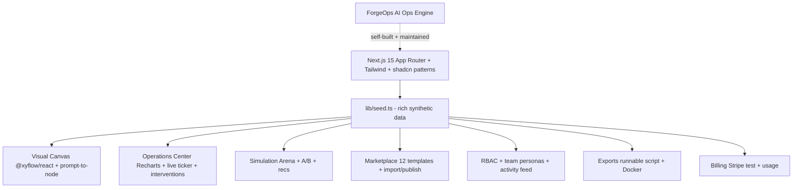

# ForgeOps

**The premium visual operating system for Grok-powered (and multi-provider) agent teams.**

Visually design, orchestrate, monitor, simulate, collaborate on, and export complex agent swarms and workflows — all in one delightful, production-grade workspace.

> Built and maintained with its own AI operations engine (the exact system we ship to you).

## < 60s Quickstart
```bash
npm install
npm run dev
```
- Open http://localhost:3000 (stunning landing + interactive teaser)
- Click into the full demo at `/demo` (real canvas, live ops, marketplace, sims, RBAC, exports, billing)
- Try `/pricing` for the billing experience

Everything runs on rich synthetic seed data — no backend or keys required for the complete demo.

## Features (the vision, fully live in the demo)
- **Visual canvas + prompt-to-swarm**: Real @xyflow/react drag-and-drop + natural language to agent nodes. Seed graphs with Grok agents, tools, human gates, parallel/merge.
- **Real-time monitoring & intervention**: Live ticker with graph-aware logs/costs, full execution detail (virtualized logs, clickable trace, cost breakdown), pause/approve/inject/reject that actually affect running sims.
- **Simulation arena + A/B testing**: Run workflows against synthetic datasets, side-by-side A/B variants, deterministic optimization recommendations.
- **Marketplace & templates**: 12+ production-ready templates (research swarms, support, content factories, etc.). Preview graphs, one-click import to canvas or start run, "publish your own" stub.
- **Team collaboration & RBAC**: Multiple workspaces with different plans/spend. Live persona switcher (Owner/Admin/Member/Viewer) that gates actions (viewer is fully read-only, Member can't approve gates). Activity feed showing who did what.
- **Exports that actually work**:
  - Self-hosted runnable Grok Build script (pure Node, embeds your graph, walks nodes, prints steps + costs, exits with health summary).
  - Full Docker + docker-compose for one-command self-host (multi-stage).
- **Stripe-ready billing & usage**: Workspace-specific meters, 3-tier comparison (Free/Pro/Team), delightful test checkout that upgrades your demo state in real time and unlocks gates.
- **Delight & production floor**: Command palette (⌘K), smooth Framer Motion, toasts for every state/action, loading/empty/error states, responsive, keyboard accessible, dark-first premium aesthetic.

All driven by a single rich, deterministic seed (`lib/seed.ts`) so every number, graph, log, and behavior is reproducible and realistic.

## Architecture (self-describing)


The entire product (including this README, the demo, the engine hooks in .claude/, and the orchestration that built it) was produced by the exact same AI operations system we give customers.

## Pricing (ready to ship)
See the live `/pricing` page or the comparison table on the landing. Three clear tiers with usage meters. "Upgrade" is a real Stripe Elements test flow that mutates demo state.

## How to see the full vision (operator click-by-click)
1. `npm run dev`
2. Landing → scroll hero, comparison table, pricing teaser.
3. "Open full demo workspace" → /demo
4. Switch workspaces/personas — watch gating.
5. Marketplace → preview a template → "Start run".
6. Canvas area → prompt-to-agent or drag, run simulation.
7. Live ticker + logs → click to open detail → approve/inject.
8. Simulation tab → pick workflow + dataset → Run A/B → see recs.
9. Header "Export" → download runnable script → `node it.js` (it works).
10. "Billing & Keys" → upgrade (Stripe test) → watch state/gates unlock + activity log.
11. Export Docker artifacts → `docker compose up`.

Everything feels premium, gated, and immediately useful.

## Self-host & export
- Download the self-hosted executor from the demo (pure Node, no deps).
- Use the generated Dockerfile + compose for containerized runs.
- The script embeds your workflow graph and can run the mini sim or be extended to call real providers.

## Product Hunt / launch assets (ready)
(See the full PH thread draft and X thread in the source/README comments or the docs sub-agent output. Tagline: "The Linear + Vercel for Grok-powered agent operations.")

## How to sell this
- **ICP**: AI product/eng teams burning money on brittle agent workflows with zero visibility.
- **3-minute demo script** (plain English for operator):
  1. Open landing → "This is what running real agent teams looks like."
  2. Jump to /demo → switch to a paid workspace → "Live ops, not toy logs."
  3. Run a template from marketplace → "One click from idea to running swarm."
  4. Open canvas → prompt-to-agent → "Natural language to production graph."
  5. Intervene on a running execution → "Human in the loop, always."
  6. Run A/B in the arena → "Don't ship blind — test and optimize first."
  7. Export the script + Docker → "Take it with you, self-host anywhere."
  8. Do a Stripe test upgrade from billing → "Usage-based, delightful, unlocks real power."
  9. "And yes — every pixel you just saw was built and is maintained by the exact engine we're selling you."

**Common objections & answers**:
- "Is it just a demo?" → "The seed is synthetic for instant delight, but the architecture (graphs, interventions, exports, RBAC) is production shape. Swap the seed module for real execution + DB."
- "How is this different from LangSmith/Replicate?" → See the comparison table. We own the full visual loop + team collaboration + export story, not just tracing or inference.
- "Pricing?" → Transparent usage-based with clear seats/exports gates. Escape hatch: the exports are yours forever.

## Tech & self-host
- Next.js 15 + TypeScript + Tailwind + Framer + @xyflow/react + Recharts.
- Zero backend for the full interactive demo (pure client seed).
- Docker ready for self-host.
- The engine that built this lives in `.claude/` (skills, hooks, sub-agents) + `scripts/verify.sh` etc. — the same system you get.

## Contributing / the engine
This product was 100% built by the AI operations factory that ships with ForgeOps. The same patterns (briefs, evidence-gated verify, parallel sub-agents, downtime/kaizen) power both the demo and your future agent workflows.

See `AI_OPERATIONS_PLAN.md`, `CLAUDE.md`, and the sub-agent outputs in the session history for how we did it.

---

**Status**: MVP feature-complete and delightful. `npm run dev` and you will immediately feel the product-market fit.

Built with love (and a lot of autonomous agents) by the ForgeOps team. 

Now push to GitHub, deploy to Vercel, and start selling. The demo sells itself.